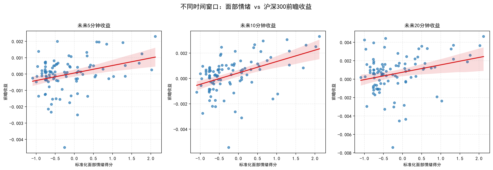
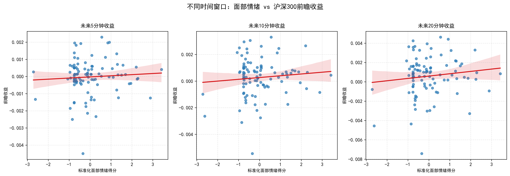

# SURF Project: Independent Replication & Re-analysis

本仓库是对我在 2026 年暑期参与的 SURF 项目的独立复盘与再分析。

项目主要围绕央行发布会中的非语言信息与短期金融市场反应展开。本仓库将重点拆解原研究中的数据处理、变量构造与实证分析流程，并记录我对其中方法、研究设计及潜在改进方向的理解与思考。

同时，也希望能为像我一样第一次接触相关内容的同学，提供简单的实践案例。我会尽可能以我的理解说明每一步 **“为什么这样做”**，而不仅仅展示最终代码和结果。

Note: 本仓库并非对原 SURF 项目的完整复现，而是基于有限数据进行的独立复盘、方法理解与再分析。

## Contents

- [1. 原 SURF 项目简介及本仓库复盘说明](#1-原-surf-项目简介及本仓库复盘说明)
- [2. 数据分析复盘](#2-数据分析复盘)
  - [2.1 样本采集](#21-样本采集)
  - [2.2 情绪概念定义与标准化](#22-情绪概念定义与标准化)
  - [2.3 未来收益函数](#23-未来收益函数)
  - [2.4 线性回归分析](#24-线性回归分析)
- [3. 实证分析结果](#3-实证分析结果)
- [4. 局限性与后续分析](#4-后续分析)

---

## 1. 原 SURF 项目简介及本仓库复盘说明

我参加的 SURF 项目标题为：

**Research on the Effect of Nonverbal Information in Central Bank Communication: A Multimodal Big Data Perspective**

以一句话概括，这个项目试图回答一个问题：

> 央行新闻发布会中的非语言信息（面部情绪）是否能够影响之后的股票市场收益？

该话题具有一定研究价值，但在数据数量、研究设计和变量构造等方面存在一定简化和不足。本项目在一定程度上也承担了本科阶段金融数据处理与数据分析训练的作用。

本仓库的目标不是简单复述原项目，而是重新梳理整个分析流程，并尝试理解其中每一步方法背后的统计与经济含义。

---

## 2. 数据分析复盘

### 2.1 样本采集

通过小组合作，我们获得了 2019–2025 年全部有央行行长参加的发布会视频，并通过文字识别、帧采样等方式取得了情绪关键帧。

随后利用腾讯混元模型对文本以及每一帧的面部表情进行情绪识别，从而获得相应的情绪数据。

在本次复盘分析中，出于对团队研究成果的尊重以及仅供演示的考虑，我只选取以下 13 场发布会的情绪及对应股票数据：

- 20190115
- 20190310
- 20230113
- 20230303
- 20230714
- 20230727
- 20231228
- 20250114
- 20250428
- 20250507
- 20250522
- 20250714
- 20250922

#### 沪深 300 数据

沪深 300 作为反映中国大盘表现的重要指数，被用于评估发布会情绪与股票市场短期波动之间的关系。

由于缺乏 Wind 等专业金融终端的数据支持，本次复盘使用的沪深 300 分钟级交易数据主要通过第三方渠道获得。

数据范围主要覆盖上述发布会期间，每分钟情绪帧对应的：

- t+0
- t+5
- t+10
- t+20

时点的沪深 300 价格。

> Data limitation: 由于分钟级金融数据并非来自 Wind 等专业金融数据库，因此数据质量、时间戳精度以及价格定义等问题需要在后续分析中进一步考虑。

---

### 2.2 情绪概念定义与标准化

#### 2.2.1 情绪分类

首先，我们按照两种方式规定了情感分类：

| 分类 | 负面 | 积极 | 中立 | 排除 |
|---|---|---|---|---|
| Face-A | Disgust, Sadness, Anger | Happiness | Surprise, Natural | - |
| Face-B | Sadness, Anger | Happiness | Surprise, Natural | Disgust |

#### 2.2.2 Facet：一分钟情绪指数

在原研究中，我们将情绪指数定义为 Facet，用于描述一分钟内情绪的总体表现。

原研究中的 Facet 定义为：

$$
\text{Facet} = \frac{\text{NegFace} - \text{PosFace}}{\text{PosFace} + \text{NegFace}}
$$

由于我的数据有限，同时由于情绪表达较少，有大量一分钟内只有一种情绪的情况。

如果直接采用原研究的方法，将会出现大量：

$$
\text{Facet} = 1
$$

或：

$$
\text{Facet} = -1
$$

的情况。

为了降低这种离散化现象，我将中立帧也加入了考量，并采用以下形式：

$$
\text{Facet} = \frac{\text{PosFace} - \text{NegFace}}{\text{PosFace} + \text{NegFace} + \text{NeuFace}}
$$

其中：

- $\text{PosFace}$：一分钟内正面情绪帧数
- $\text{NegFace}$：一分钟内负面情绪帧数
- $\text{NeuFace}$：一分钟内中立情绪帧数

从该表达式可以看出：

$$
-1 \leq \text{Facet} \leq 1
$$

Facet 越接近 $1$，表示该分钟的情绪越偏向正面；越接近 $-1$，则表示情绪越偏向负面。

> Methodological note: 将中立情绪加入分母并不意味着这种定义一定优于原始定义，而是针对本次复盘数据中大量 $\text{Facet} = \pm 1$ 的情况所进行的一种 alternative specification。

#### 2.2.3 为什么进行标准化？

接下来，我对数据进行了标准化处理。

之所以进行标准化，是为了让情绪表现变成一个更容易理解和比较的量。

如果不进行标准化，我的结论可能会变成：

> 情绪每提高 $0.0001$，收益上涨 $0.12\%$。

而标准化之后，则可以表达为：

> 情绪每提高一个标准差（standard deviation），收益平均上涨多少。

举一个简单的例子。

假设有一个数组：

$$
[0, 10, 20, 30, 40, 50, 60, 70, 80, 90, 100]
$$

在这个数据集中，变化 $10$ 个单位并不算特别大。

但是，如果数据来自：

$$
[87, 88, 89, 90, 91, 92, 93]
$$

那么变化 $10$ 个单位就显得非常夸张。

因此，情绪分数等数字本身是比较抽象的。标准化提供了一个统一的尺度，使我们可以用“偏离平均水平多少个标准差”来理解情绪变化。

#### 2.2.4 Z-score 标准化

标准化公式为：

$$
Z = \frac{X - \bar{X}}{s}
$$

其中：

- $X$：原变量
- $\bar{X}$：变量的平均值
- $s$：变量的标准差
- $Z$：标准化后的变量

标准化实际上完成了两个步骤：

减去平均值，使变量以 $0$ 为中心；

除以标准差，使变量的单位变成“一个标准差”。

因此：

- $Z = 0$：处于平均水平
- $Z = 1$：高于平均水平一个标准差
- $Z = -1$：低于平均水平一个标准差
- $Z = 2$：高于平均水平两个标准差

#### 2.2.5 标准化是否改变线性回归结果？

值得注意的是，对自变量进行标准化并不会改变其与因变量之间的线性关系。

它本质上只是改变了度量单位，就像：

$$
1 \text{ m} = 100 \text{ cm}
$$

描述的是同一个长度。

假设原来的线性回归模型为：

$$
Y = \alpha + \beta X + \epsilon
$$

将标准化后的变量：

$$
Z = \frac{X - \bar{X}}{s}
$$

代入标准化后的回归模型：

$$
Y = \alpha^* + \beta^* Z + \epsilon
$$

得到：

$$
Y = \alpha^* + \beta^* \frac{X - \bar{X}}{s} + \epsilon
$$

整理：

$$
Y = \left( \alpha^* - \frac{\beta^* \bar{X}}{s} \right) + \frac{\beta^*}{s}X + \epsilon
$$

可以看到，最终仍然可以写成：

$$
Y = \alpha + \beta X + \epsilon
$$

其中：

$$
\alpha = \alpha^* - \frac{\beta^* \bar{X}}{s}
$$

以及：

$$
\beta = \frac{\beta^*}{s}
$$

因此，标准化主要改变的是系数的表达方式和单位。

在带截距的 OLS 回归中，对自变量进行这种线性标准化不会改变：

- $R^2$
- fitted values
- residuals
- $t$ statistic
- $p$ value

但回归系数的数值会发生变化。

标准化后的 $\beta^*$ 可以解释为：

> 当情绪指数提高一个标准差时，未来收益平均变化多少。

---

### 2.3 未来收益函数

为了评估发布会情绪对股票价格的影响，我们需要定义收益函数。

以五分钟收益为例：

$$
R_{t,t+5} = \ln\left( \frac{P_{t+5}}{P_t} \right)
$$

其中：

- $P_t$：时刻 $t$ 的沪深 300 价格
- $P_{t+5}$：时刻 $t+5$ 的沪深 300 价格

#### 为什么使用收益率而不是价格差？

首先，我们不能简单地使用股票价格差：

$$
P_{t+5} - P_t
$$

来评估收益。

因为相同的价格变化，在不同价格水平下代表的市场反应完全不同。

例如：

$$
1 \rightarrow 2
$$

价格上涨 $1$ 元，但收益率实际上为：

$$
\frac{2-1}{1} = 100\%
$$

而如果：

$$
100 \rightarrow 101
$$

同样上涨 $1$ 元，但收益率只有：

$$
\frac{101-100}{100} = 1\%
$$

因此，我们通常需要使用相对变化，即收益率，而不是绝对价格差。

#### 为什么使用对数收益率？

普通收益率可以写成：

$$
\frac{P_{t+5} - P_t}{P_t}
$$

但这种收益率在多个时间区间之间进行加总时并不方便。

对数收益率则具有：

$$
\ln\left( \frac{P_2}{P_1} \right) + \ln\left( \frac{P_3}{P_2} \right) = \ln\left( \frac{P_3}{P_1} \right)
$$

因此，多个连续时间区间的对数收益可以直接相加。

这使得对数收益率在时间序列金融数据处理中更加方便。

---

### 2.4 线性回归分析

线性回归模型可以用来检验发布会期间的面部情绪与未来股票收益之间是否存在统计上的线性关系。

本次分析中的基本模型为：

$$
R_{t,t+h} = \alpha + \beta E_t + \epsilon_t
$$

其中：

- $R_{t,t+h}$：从发布会情绪时刻 $t$ 开始，未来 $h$ 分钟的沪深 300 收益
- $E_t$：时刻 $t$ 的标准化面部情绪
- $\alpha$：截距
- $\beta$：情绪与未来收益之间的估计关系
- $\epsilon_t$：误差项

#### 2.4.1 $\alpha$ 与 $\epsilon_t$ 的区别

这里容易产生一个误解：模型中看起来似乎有两个“截距”。

实际上：

$$
\alpha
$$

和：

$$
\epsilon_t
$$

具有完全不同的含义。

当：

$$
E_t = 0
$$

时，模型的预测收益为：

$$
\hat{R}_{t,t+h} = \alpha
$$

因此，$\alpha$ 可以理解为：

> 当标准化情绪处于平均水平时，模型预测的基本收益水平。

而 $\epsilon_t$ 并不是第二个截距。

它表示在某一个具体时间点：

> 实际收益与模型预测收益之间的差异。

即：

$$
\epsilon_t = R_{t,t+h} - \hat{R}_{t,t+h}
$$

因此：

- $\alpha$：模型中的固定截距
- $\epsilon_t$：每一个观测值自己的误差项

#### 2.4.2 最小二乘法的目标
线性回归的目标是找到一组最合适的 $\alpha$ 和 $\beta$，使模型预测值与实际观测值之间的误差尽可能小。

对于每一个观测值，都可以计算一个误差：

$$
\epsilon_t = R_{t,t+h} - (\alpha + \beta E_t)
$$

也就是说：
> 实际收益 − 模型预测收益 = 误差

OLS（Ordinary Least Squares，普通最小二乘法）并不是简单地让这些误差相加，而是让**误差的平方和最小**：

$$
\min_{\alpha,\beta} \sum_t \left[ R_{t,t+h} - \alpha - \beta E_t \right]^2
$$

之所以使用平方，是因为不同观测值的误差可能有正有负。如果直接相加，正负误差可能相互抵消。
例如：

$$
0.01 + (-0.01) = 0
$$

虽然结果为 $0$，但实际上两个观测值都存在误差。

平方以后：

$$
0.01^2 + (-0.01)^2 > 0
$$

因此，平方可以避免正负误差相互抵消。

简单来说，OLS 所做的事情就是：
> **寻找一条最合适的直线，使所有数据点与这条直线之间的总体偏离程度尽可能小。**

在本研究中，这条直线表示：

$$
\hat{R}_{t,t+h} = \hat{\alpha} + \hat{\beta} E_t
$$

其中 $\hat{R}$ 是模型根据情绪预测出的未来收益。

---

#### 2.4.3 $\beta$ 的含义
在本研究中，$\beta$ 是最值得关注的参数。

我们的情绪变量 $E_t$ 已经经过 Z-score 标准化，因此：

$$
E_t = \frac{X_t - \bar{X}}{s}
$$

所以 $\beta$ 可以解释为：
> **当面部情绪提高一个标准差时，未来沪深300收益平均发生多少变化。**

例如，如果某一次回归得到：

$$
\beta = 0.002
$$

那么可以理解为：
> 面部情绪提高一个标准差，与未来收益增加约 $0.02\%$ 相关。

如果：

$$
\beta > 0
$$

说明情绪与未来收益之间呈正向线性关系。

如果：

$$
\beta < 0
$$

则说明二者呈负向线性关系。

需要注意的是，$\beta$ 描述的是**统计上的线性关系**，并不能仅凭这个回归结果证明面部情绪对股票收益存在因果影响。

---

#### 2.4.4 如何判断 $\beta$ 是否显著？
仅仅观察 $\beta$ 是正数还是负数还不够。

例如：

$$
\beta = 0.002
$$

看起来是正相关，但我们还需要判断：
> 这个正相关是真实存在的统计关系，还是仅仅由样本中的随机波动造成的？

因此，我们通常需要进行假设检验。

首先建立原假设：

$$
H_0: \beta = 0
$$

它表示：
> **面部情绪与未来收益之间不存在系统性的线性关系。**

然后根据估计出来的 $\beta$ 和它的标准误计算 t-statistic：

$$
t = \frac{\hat{\beta}}{\text{SE}(\hat{\beta})}
$$

这里：
* $\hat{\beta}$：回归得到的情绪系数
* $\text{SE}(\hat{\beta})$： $\hat{\beta}$ 的标准误
* $t$：衡量 $\beta$ 距离 $0$ 有多远

直观地说：
> 如果 $\beta$ 很大，但它的标准误也很大，那么我们并不能确定这个关系是否真实存在。

反过来，如果：
> $\beta$ 相对于它的标准误足够大，

那么我们就有更强的证据认为 $\beta$ 不等于 $0$。

---

#### 2.4.5 p-value 的含义
在得到 t-statistic 后，我们进一步得到 p-value。

p-value 用于衡量：
> **如果实际上 $\beta=0$，那么观察到当前这样大的统计结果有多罕见。**

一般情况下：

$$
p < 0.05
$$

可以认为结果在 5% 的显著性水平下具有统计显著性。

本研究中可以简单按照以下标准理解：

| p-value     | 解释   |
| ----------- | ---- |
| $p<0.01$    | 非常显著 |
| $p<0.05$    | 显著   |
| $p<0.10$    | 边际显著 |
| $p\geq0.10$ | 不显著  |

需要注意：
> **“不显著”并不等于证明情绪与收益完全无关。**

它更准确地表示：
> 在当前样本量、变量定义和模型设定下，没有足够的统计证据拒绝 $\beta=0$。

这一点对于本研究尤其重要，因为目前使用的发布会样本数量相对有限。

---

#### 2.4.6 为什么需要 Newey-West HAC 标准误？
在最简单的 OLS 模型中，我们通常假设不同观测值之间的误差相互独立，而且具有相同的方差。

但金融时间序列数据往往不完全满足这些条件。

例如，在计算未来 5 分钟收益时：

$$
R_{t,t+5} = \ln\left( \frac{P_{t+5}}{P_t} \right)
$$

而相邻时间点的未来收益窗口可能存在重叠。

因此，不同观测值对应的误差项可能存在一定程度的相关性。

如果仍然使用普通 OLS 标准误，可能会低估 $\beta$ 的不确定性，从而使：
* 标准误偏小
* t-statistic 偏大
* p-value 偏小

最终可能导致我们错误地认为某个关系具有统计显著性。

因此，本研究进一步使用 **Newey-West HAC（Heteroskedasticity and Autocorrelation Consistent）标准误**。

HAC 可以理解为：
> **在计算标准误时，同时考虑异方差（Heteroskedasticity）和序列相关（Autocorrelation）。**

这里需要特别区分：

**OLS 本身负责估计 $\alpha$ 和 $\beta$。**

而：
**Newey-West HAC 主要负责重新计算更加稳健的标准误。**

因此，它并不会改变已经估计出来的：

$$
\hat{\alpha}
$$

和：

$$
\hat{\beta}
$$

而是改变：

$$
\text{SE}_{\text{HAC}}(\hat{\beta})
$$

进而影响：

$$
t
$$

和：

$$
p
$$

可以简单理解为：
> OLS 告诉我们“关系估计出来是多少”，而 HAC 帮助我们更谨慎地判断“这个估计有多确定”。

---

#### 2.4.7 本研究的实际回归过程
因此，从数据到最终结论，整个回归过程可以概括为：

**Step 1：获得情绪变量**
从发布会视频中得到每一分钟的面部情绪，并计算 Facet。

↓

**Step 2：标准化情绪**
将 Facet 转换为 Z-score：

$$
Z = \frac{X - \bar{X}}{s}
$$

得到标准化情绪变量 $E_t$。

↓

**Step 3：匹配股票数据**
根据时间戳，将发布会情绪数据与对应时间的沪深300分钟级数据进行匹配。

↓

**Step 4：计算未来收益**
对于每一个情绪观测时刻 $t$，计算未来不同时间窗口的收益：

$$
R_{t,t+5} = \ln\left( \frac{P_{t+5}}{P_t} \right)
$$

$$
R_{t,t+10} = \ln\left( \frac{P_{t+10}}{P_t} \right)
$$

$$
R_{t,t+20} = \ln\left( \frac{P_{t+20}}{P_t} \right)
$$

↓

**Step 5：进行 OLS 回归**
分别估计：

$$
R_{t,t+h} = \alpha + \beta E_t + \epsilon_t
$$

其中：

$$
h = 5, 10, 20
$$

↓

**Step 6：使用 Newey-West HAC 标准误**
在考虑异方差和序列相关后重新计算标准误。

↓

**Step 7：进行统计检验**
根据：

$$
t = \frac{\hat{\beta}}{\text{SE}_{\text{HAC}}(\hat{\beta})}
$$

得到 t-statistic 和 p-value。

↓

**Step 8：解释结果**
最终主要关注：
* $\beta$ 的正负
* $\beta$ 的大小
* t-statistic
* p-value
* $R^2$

从而判断：
> 发布会中的面部情绪是否与之后 5、10、20 分钟的沪深300收益存在统计上的线性关系。

---

#### 2.4.8 如何理解回归结果？
例如，如果得到：

$$
\beta > 0
$$

且：

$$
p < 0.05
$$

那么可以认为：
> 在当前模型和样本下，面部情绪与未来收益之间存在显著的正向线性关系。

如果：

$$
\beta < 0
$$

且：

$$
p < 0.05
$$

则可以认为：
> 在当前模型和样本下，面部情绪与未来收益之间存在显著的负向线性关系。

但如果：

$$
p \geq 0.10
$$

则应表述为：
> 在当前样本和模型设定下，没有发现足够的统计证据表明面部情绪与未来收益之间存在显著的线性关系。

而不应该直接写成：
> “情绪与股票收益完全无关。”

因为“不显著”表示的是：
> **我们没有足够证据证明存在关系。**

而不是：
> **我们证明了不存在关系。**

---

#### 2.4.9 关于 $R^2$
除了 $\beta$ 和 p-value 之外，回归结果还会给出 $R^2$。

$R^2$ 可以简单理解为：
> **模型中的情绪变量能够解释未来收益变化的多少比例。**

例如：

$$
R^2 = 0.05
$$

表示模型中的自变量可以解释约 5% 的因变量变动。

但在本研究中，需要谨慎解释 $R^2$。

金融市场的短期收益受到大量因素影响，包括宏观经济信息、政策信息、市场情绪、交易行为以及随机市场波动等。

因此，即使情绪变量具有统计显著性，也不意味着它能够解释大部分市场变化。

反过来，一个较低的 $R^2$ 也并不自动意味着变量没有研究价值。

对于本研究而言，更重要的是综合观察：

$$
\boxed{ \beta + p\text{-value} + R^2 + \text{经济含义} }
$$

而不是只关注其中某一个指标。

---

#### 2.4.10 本节分析的局限
需要注意的是，目前的回归模型属于比较基础的单变量线性回归：

$$
R_{t,t+h} = \alpha + \beta E_t + \epsilon_t
$$

模型只使用面部情绪作为解释变量，并没有进一步控制其他可能影响股票收益的因素。

例如：
* 发布会中的文字内容
* 发布会前后的其他经济新闻
* 市场整体趋势
* 发布会发生的具体时间
* 不同发布会之间的差异

因此，即使 $\beta$ 最终具有统计显著性，也不能直接将其解释为面部情绪对市场收益的因果影响。

后续分析可以进一步加入文本情绪、控制变量以及不同的事件窗口，从而检验面部情绪是否在控制其他信息后仍然具有额外的解释能力。

---

## 3. 实证分析结果

### 3.1 基准回归结果

在完成情绪数据处理和未来收益计算后，本部分使用线性回归分析面部情绪与沪深 300 后续收益之间的关系。

基本回归模型为：

$$
R_{t,t+h} = \alpha + \beta E_t + \epsilon_t
$$

其中：

* $R_{t,t+h}$：从情绪观测时刻 $t$ 到未来 $t+h$ 的沪深 300 累计对数收益
* $E_t$：时刻 $t$ 的标准化面部情绪得分
* $\alpha$：截距项
* $\beta$：面部情绪与未来收益之间的估计关系
* $\epsilon_t$：模型无法解释的部分

本次分析主要考察以下几个时间窗口：

* $t+5$ 分钟
* $t+10$ 分钟
* $t+20$ 分钟
* 隔夜收益（overnight return）

由于分钟级数据之间可能存在时间上的相关性，直接使用普通 OLS 标准误可能会低估回归系数的不确定性。

因此，本次回归采用：

> **OLS with Newey-West HAC standard errors**

也就是说，回归系数仍然通过 OLS 估计，但使用 Newey-West HAC 方法重新估计标准误，从而在一定程度上处理异方差和时间序列自相关问题。

回归结果如下：

| Emotion | Horizon   |   N |     Beta | HAC Standard Error | t-statistic | p-value | R-squared |
| ------- | --------- | --: | -------: | -----------------: | ----------: | ------: | --------: |
| Face-A  | T+5       |  97 | 0.000460 |           0.000114 |       4.017 |  <0.001 |    0.0986 |
| Face-A  | T+10      |  97 | 0.000897 |           0.000171 |       5.251 |  <0.001 |    0.2012 |
| Face-A  | T+20      |  97 | 0.000802 |           0.000268 |       2.999 |  0.0027 |    0.0781 |
| Face-A  | Overnight | 118 | 0.000436 |           0.000351 |       1.241 |  0.2147 |    0.0500 |
| Face-B  | T+5       |  97 | 0.000460 |           0.000115 |       4.017 |  <0.001 |    0.0986 |
| Face-B  | T+10      |  97 | 0.000897 |           0.000171 |       5.251 |  <0.001 |    0.2012 |
| Face-B  | T+20      |  97 | 0.000802 |           0.000268 |       2.999 |  0.0027 |    0.0781 |
| Face-B  | Overnight | 117 | 0.000420 |           0.000350 |       1.199 |  0.2305 |    0.0468 |

完整回归结果可以在以下文件中查看：

`results/SURF_OLS_results.xlsx`

---

### 3.2 日内收益结果

对于日内收益窗口，Face-A 和 Face-B 均表现出正向的回归系数。

以 $t+10$ 分钟收益为例：

$$
\beta = 0.000897
$$

由于情绪变量已经进行了 Z-score 标准化，该系数可以理解为：

> 当面部情绪得分提高一个标准差时，之后 10 分钟的沪深 300 对数收益平均增加约 $0.000897$。

近似换算为百分比：

$$
0.000897 \approx 0.0897\%
$$

同时，该结果在使用 Newey-West HAC 标准误后仍然具有较强的统计显著性：

$$
t = 5.251
$$

且：

$$
p < 0.001
$$

$t+5$ 和 $t+20$ 的结果也表现出类似的正向关系。

因此，在当前样本中可以观察到：

$$
\text{更高的面部情绪得分}
\rightarrow
\text{更高的后续日内收益}
$$

其中，$t+10$ 的关系最强，对应：

$$
R^2 = 0.201
$$

这意味着，在当前的简单单变量回归模型中，情绪变量与未来 10 分钟收益之间存在较明显的线性关联。

但这里需要特别注意：

> $R^2 = 0.201$ 并不意味着面部情绪“解释了市场 20% 的全部变化”，更不能直接说明面部情绪是导致市场变化的原因。

当前模型只包含一个情绪变量，而真实金融市场同时受到大量因素影响。

因此，这个结果更准确的描述应该是：

> 在当前样本和当前模型设定下，面部情绪得分与未来 10 分钟沪深 300 收益之间存在较强的统计线性关系。

---

### 3.3 基准回归结果可视化

下图展示了标准化面部情绪得分与未来沪深 300 日内收益之间的关系。

图中分别展示：

* $t+5$ 分钟收益
* $t+10$ 分钟收益
* $t+20$ 分钟收益

每个散点代表一个分钟级观测值，红色直线表示对应的线性回归趋势。

<!-- 图片接口：将图片放入 results 文件夹 -->

> **Figure 1. 标准化面部情绪与未来沪深 300 日内收益之间的线性回归关系。**

从图中可以直观观察到，在当前样本中，情绪得分与后续收益整体呈现正向趋势。

不过，散点图只能帮助我们观察数据中的整体趋势，不能单独作为统计显著性的依据。因此，具体结论仍然需要结合前面的回归系数、标准误和 p-value 进行判断。

---

### 3.4 隔夜收益结果

除了日内收益，本次分析还单独考察了隔夜收益。

隔夜收益的计算方式与日内收益不同。

对于需要跨越非交易时间的数据，使用：

$$
R_{overnight} = \ln\left( \frac{P_{next\ open}}{P_{current\ close}} \right)
$$

即使用当天收盘价格与下一个交易日开盘价格计算隔夜收益。

Face-A 的结果为：

$$
\beta = 0.000436
$$

但：

$$
p = 0.2147
$$

Face-B 的结果为：

$$
\beta = 0.000420
$$

但：

$$
p = 0.2305
$$

因此，虽然两个情绪变量的回归系数均为正，但其统计显著性不足。

换句话说：

> 当前样本没有提供足够的统计证据证明面部情绪与隔夜沪深 300 收益之间存在稳定的线性关系。

这与日内结果形成一定对比。

当前结果可能意味着：

* 面部情绪与短期市场反应之间可能存在更明显的同步关系；
* 这种关系可能主要集中在发布会后的短时间窗口；
* 当时间跨度延长到隔夜后，其他市场信息和事件可能逐渐占据更大的影响。

不过，由于样本量有限，这些解释仍然属于初步推测。

---

### 3.5 安慰剂检验

在得到显著的回归结果后，一个重要的问题是：

> 当前发现的统计关系，是否只是由于数据匹配方式或回归方法本身产生的随机结果？

为了对此进行初步检验，我进行了安慰剂检验。

具体方法是：

1. 保持沪深 300 收益数据不变；
2. 保持情绪数据的数值分布不变；
3. 随机打乱情绪数据之间的时间顺序；
4. 重新使用相同的 OLS + Newey-West HAC 方法进行回归。

这样做会破坏原始数据中：

$$
\text{情绪}
\leftrightarrow
\text{时间}
\leftrightarrow
\text{市场收益}
$$

之间的真实时间对应关系。

如果随机打乱之后仍然频繁出现与原结果类似的强显著关系，那么可能意味着：

> 当前的显著性部分来自数据处理方法、时间匹配方式或模型结构，而不是原始情绪数据本身。

安慰剂检验的结果如下：

| Emotion | Horizon   |   N |      Beta | HAC p-value | Result |
| ------- | --------- | --: | --------: | ----------: | ------ |
| Face-A  | T+5       |  97 |  0.000066 |      0.5076 | 不显著    |
| Face-A  | T+10      |  97 |  0.000134 |      0.3263 | 不显著    |
| Face-A  | T+20      |  97 |  0.000242 |      0.2392 | 不显著    |
| Face-A  | Overnight | 118 | -0.000297 |      0.1122 | 不显著    |
| Face-B  | T+5       |  97 |  0.000066 |      0.5076 | 不显著    |
| Face-B  | T+10      |  97 |  0.000134 |      0.3263 | 不显著    |
| Face-B  | T+20      |  97 |  0.000242 |      0.2392 | 不显著    |
| Face-B  | Overnight | 117 | -0.000327 |      0.0695 | 边际显著   |

与原始结果相比，随机打乱情绪数据之后，原本在日内收益中出现的显著关系基本消失。

例如：

原始数据中的 $t+10$ 回归结果为：

$$
\beta = 0.000897
$$

且：

$$
p < 0.001
$$

而随机打乱后的 Placebo Test 得到：

$$
\beta = 0.000134
$$

且：

$$
p = 0.3263
$$

即不再具有统计显著性。

---

### 3.6 检验结果可视化

下图展示了随机打乱情绪数据之后，安慰剂检验中情绪变量与未来收益之间的关系。

<!-- 图片接口：将安慰剂检验图片放入 results 文件夹 -->

> **Figure 2. 随机打乱情绪数据后，情绪变量与未来沪深 300 收益之间的回归关系。**

与原始回归图相比，随机情绪变量不再表现出明显且稳定的正向趋势。

这提供了一个初步证据：

> 原始回归中的显著关系并不是简单地通过“任意一个随机变量 + 当前市场数据”就可以产生。

换句话说，原始结果至少在这一次随机安慰剂检验中表现出了对真实时间匹配关系的依赖。

---

### 3.7 对安慰剂检验的谨慎解释

尽管安慰剂检验没有得到与原始回归类似的显著结果，但这并不能证明原始结果一定具有因果关系。

目前的安慰剂检验只进行了单次随机打乱。

更严格的方法应该是进行多次随机排列，例如：

$$
1000
$$

次。

每次随机打乱情绪数据之后，都重新进行回归，并记录对应的：

* $\beta$
* $t$ statistic
* $p-value$

最终可以得到一个随机情况下的系数分布：

$$
\beta_1^{placebo},
\beta_2^{placebo},
\ldots,
\beta_{1000}^{placebo}
$$

然后将真实回归得到的系数与该随机分布进行比较。

如果真实系数位于随机分布的极端位置，则可以进一步说明：

> 当前观察到的关系在随机情绪—市场匹配下较难出现。

因此，目前的安慰剂检验应被理解为：

> 一个初步的随机性检查，而不是对因果关系的证明。

---

### 3.8 Preliminary Conclusion

在当前有限样本中，标准化面部情绪得分与之后的沪深 300 日内收益表现出明显的正向统计关系。

该关系在：

* $t+5$
* $t+10$
* $t+20$

三个时间窗口中均具有统计显著性，并且在使用 Newey-West HAC 标准误之后仍然存在。

同时，随机打乱情绪数据后的安慰剂检验未能复现原始数据中的显著日内关系。

这意味着：

> 当前观察到的关系并不能简单地解释为任意随机情绪变量与市场收益之间的偶然拟合。

但是，这仍然不能证明面部情绪直接导致了市场收益变化。

在真实的发布会过程中，面部情绪可能与其他变量同时变化，例如：

* 发布会的文字内容；
* 政策信息；
* 市场预期变化；
* 新闻发布时间；
* 其他同期金融信息。

因此，当前分析最合理的结论是：

> 在本次有限样本的复盘分析中，面部情绪与短期沪深 300 收益之间观察到了较明显的统计关联，并且这一关系未能通过简单的随机情绪变量复现。

更进一步的因果解释仍然需要更大的样本、更多的控制变量以及更加严格的研究设计。
