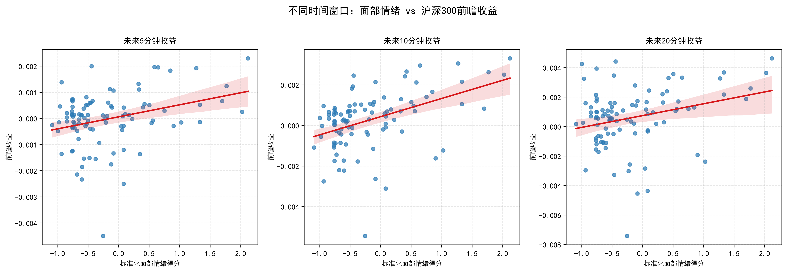
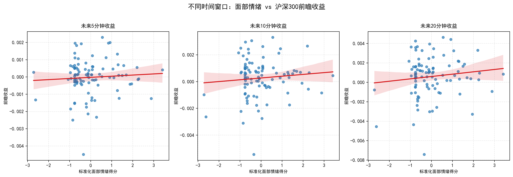

# SURF Project: Independent Replication & Re-analysis

**English** | [简体中文](README_CN.md)

This repository is an independent review and re-analysis of a SURF project that I participated in during the summer of 2026.

The project examines nonverbal information in central-bank press conferences and short-horizon financial-market responses. This repository unpacks the data-processing, variable-construction, and empirical-analysis workflow in the original study, while documenting my understanding of the methods, research design, and possible improvements.

It is also intended as a practical example for students, like me, who are encountering this material for the first time. Wherever possible, I explain **why each step is taken**, rather than presenting only the final code and results.

Note: This repository is not a full replication of the original SURF project. It is an independent review, methodological learning exercise, and re-analysis based on limited data.

## Contents

- [1. Original SURF Project and Scope of This Review](#1-original-surf-project-and-scope-of-this-review)
- [2. Data-analysis Review](#2-data-analysis-review)
  - [2.1 Sample Collection](#21-sample-collection)
  - [2.2 Defining and Standardizing Emotion Measures](#22-defining-and-standardizing-emotion-measures)
  - [2.3 Future-return Function](#23-future-return-function)
  - [2.4 Linear-regression Analysis](#24-linear-regression-analysis)
- [3. Empirical Results](#3-empirical-results)
  - [3.1 Baseline Regression Results](#31-baseline-regression-results)
  - [3.2 Intraday-return Results](#32-intraday-return-results)
  - [3.3 Visualizing the Baseline Regressions](#33-visualizing-the-baseline-regressions)
  - [3.4 Overnight-return Results](#34-overnight-return-results)
  - [3.5 Placebo Test](#35-placebo-test)
  - [3.6 Visualizing the Test Results](#36-visualizing-the-test-results)
  - [3.7 Analysis of the Placebo-test Results](#37-analysis-of-the-placebo-test-results)
  - [3.8 Preliminary Conclusions](#38-preliminary-conclusions)
- [4. Limitations and Further Analysis](#4-limitations-and-further-analysis)
  - [4.1 Limited Sample Size](#41-limited-sample-size)
  - [4.2 Measurement Error in the Emotion Variables](#42-measurement-error-in-the-emotion-variables)
  - [4.3 The Current Model Does Not Control for Other Information](#43-the-current-model-does-not-control-for-other-information)
  - [4.4 Financial-data Quality and Time Matching](#44-financial-data-quality-and-time-matching)
  - [4.5 Directions for Further Analysis](#45-directions-for-further-analysis)
---

## 1. Original SURF Project and Scope of This Review

The SURF project I participated in was titled:

**Research on the Effect of Nonverbal Information in Central Bank Communication: A Multimodal Big Data Perspective**

In one sentence, the project asks:

> Can nonverbal information (facial emotion) in central-bank press conferences affect subsequent stock-market returns?

The topic has research value, but the data volume, research design, and variable construction also involve simplifications and limitations. To some extent, the project also served as training in financial-data processing and data analysis at the undergraduate level.

Rather than merely restating the original project, this repository reorganizes the full analytical workflow and seeks to understand the statistical and economic meaning of each methodological step.

The original study also examined textual sentiment and reached related conclusions. Because the workflow is similar and this review uses only part of the data for demonstration, that process is not repeated here.

---

## 2. Data-analysis Review

### 2.1 Sample Collection

Through group collaboration, we obtained videos of all 2019–2025 press conferences attended by central-bank governors. Optical character recognition and frame sampling were then used to obtain key emotion frames.

Tencent's Hunyuan model was subsequently used to identify sentiment in the text and facial emotion in each frame, producing the corresponding emotion data.

For this review, both to respect the team's research output and because the analysis is for demonstration only, I use emotion and corresponding stock data from only the following 13 press conferences:

- 20190115
- 20190310
- 20230113
- 20230303
- 20230714
- 20230727
- 20231228
- 20250114
- 20250428
- 20250507
- 20250522
- 20250714
- 20250922

#### CSI 300 Data

The CSI 300, an important index of Chinese large-cap equities, is used to assess the relationship between press-conference emotion and short-term stock-market movements.

Because professional financial terminals such as Wind were not available, the minute-level CSI 300 trading data used in this review were obtained primarily through third-party sources.

For each emotion frame, the data mainly cover CSI 300 prices at:

- t+0
- t+5
- t+10
- t+20

during the press conferences listed above.

> Data limitation: Because the minute-level financial data do not come from a professional database such as Wind, data quality, timestamp precision, and price definitions require further consideration in subsequent analysis.

---

### 2.2 Defining and Standardizing Emotion Measures

#### 2.2.1 Emotion Classification

First, emotion categories are specified in two ways:

| Classification | Negative | Positive | Neutral | Excluded |
|---|---|---|---|---|
| Face-A | Disgust, Sadness, Anger | Happiness | Surprise, Natural | - |
| Face-B | Sadness, Anger | Happiness | Surprise, Natural | Disgust |

#### 2.2.2 Facet: a One-minute Emotion Index

In the original study, the emotion index was defined as Facet, which describes overall emotion within one minute.

The original definition of Facet was:

$$
\text{Facet} = \frac{\text{NegFace} - \text{PosFace}}{\text{PosFace} + \text{NegFace}}
$$

Because my data are limited and emotion expressions are sparse, many one-minute intervals contain only one type of emotion.

Applying the original approach directly would therefore generate many cases of:

$$
\text{Facet} = 1
$$

or:

$$
\text{Facet} = -1
$$

To reduce this discretization, I also include neutral frames and use:

$$
\text{Facet} = \frac{\text{PosFace} - \text{NegFace}}{\text{PosFace} + \text{NegFace} + \text{NeuFace}}
$$

where:

- $\text{PosFace}$: number of positive-emotion frames within one minute
- $\text{NegFace}$: number of negative-emotion frames within one minute
- $\text{NeuFace}$: number of neutral-emotion frames within one minute

This expression implies:

$$
-1 \leq \text{Facet} \leq 1
$$

The closer Facet is to $1$, the more positive the emotion in that minute; the closer it is to $-1$, the more negative it is.

> Methodological note: Including neutral emotion in the denominator does not imply that this definition is necessarily superior to the original one. It is an alternative specification adopted for the many cases of $\text{Facet} = \pm 1$ in this review dataset.

#### 2.2.3 Why Standardize?

Next, I standardize the data.

Standardization converts the emotion measure into a quantity that is easier to interpret and compare.

Without standardization, a conclusion might read:

> A $0.0001$ increase in emotion is associated with a $0.12\%$ increase in returns.

After standardization, it can instead be expressed as:

> How much do returns rise, on average, when emotion increases by one standard deviation?

Consider a simple example. Suppose an array is:

$$
[0, 10, 20, 30, 40, 50, 60, 70, 80, 90, 100]
$$

In this dataset, a change of $10$ units is not especially large.

But if the data are:

$$
[87, 88, 89, 90, 91, 92, 93]
$$

a change of $10$ units is extremely large.

Emotion scores and similar values are inherently abstract. Standardization provides a common scale, allowing emotion changes to be understood as deviations from the mean in standard deviations.

#### 2.2.4 Z-score Standardization

The standardization formula is:

$$
Z = \frac{X - \bar{X}}{s}
$$

where:

- $X$: the original variable
- $\bar{X}$: the variable's mean
- $s$: the variable's standard deviation
- $Z$: the standardized variable

Standardization performs two operations:

Subtracting the mean centers the variable at $0$;

dividing by the standard deviation changes its unit to “one standard deviation.”

Therefore:

- $Z = 0$: at the mean
- $Z = 1$: one standard deviation above the mean
- $Z = -1$: one standard deviation below the mean
- $Z = 2$: two standard deviations above the mean

#### 2.2.5 Does Standardization Change Linear-regression Results?

Importantly, standardizing an independent variable does not change its linear relationship with the dependent variable.

It changes only the unit of measurement, much like:

$$
1 \text{ m} = 100 \text{ cm}
$$

which describes the same length.

Suppose the original linear-regression model is:

$$
Y = \alpha + \beta X + \epsilon
$$

Substituting the standardized variable:

$$
Z = \frac{X - \bar{X}}{s}
$$

into the standardized regression model:

$$
Y = \alpha^* + \beta^* Z + \epsilon
$$

gives:

$$
Y = \alpha^* + \beta^* \frac{X - \bar{X}}{s} + \epsilon
$$

Rearranging:

$$
Y = \left( \alpha^* - \frac{\beta^* \bar{X}}{s} \right) + \frac{\beta^*}{s}X + \epsilon
$$

The result can still be written as:

$$
Y = \alpha + \beta X + \epsilon
$$

where:

$$
\alpha = \alpha^* - \frac{\beta^* \bar{X}}{s}
$$

and:

$$
\beta = \frac{\beta^*}{s}
$$

Standardization thus mainly changes the expression and units of the coefficient.

In an OLS regression with an intercept, this linear standardization of an independent variable does not change:

- $R^2$
- fitted values
- residuals
- $t$ statistic
- $p$ value

However, it does change the numerical value of the regression coefficient.

The standardized $\beta^*$ can be interpreted as:

> The average change in future returns when the emotion index rises by one standard deviation.

---

### 2.3 Future-return Function

To assess how press-conference emotion relates to stock prices, a return function must be defined.

Using the five-minute return as an example:

$$
R_{t,t+5} = \ln\left( \frac{P_{t+5}}{P_t} \right)
$$

where:

- $P_t$: CSI 300 price at time $t$
- $P_{t+5}$: CSI 300 price at time $t+5$

#### Why Use Returns Rather Than Price Differences?

First, stock-price differences alone should not be used:

$$
P_{t+5} - P_t
$$

The same price change represents a very different market response at different price levels.

For example:

$$
1 \rightarrow 2
$$

The price rises by $1$, but the return is:

$$
\frac{2-1}{1} = 100\%
$$

Whereas if:

$$
100 \rightarrow 101
$$

the same $1$ increase represents a return of only:

$$
\frac{101-100}{100} = 1\%
$$

We therefore normally use relative change—returns—rather than absolute price differences.

#### Why Use Log Returns?

The simple return is:

$$
\frac{P_{t+5} - P_t}{P_t}
$$

but it is inconvenient to add across multiple intervals.

Log returns satisfy:

$$
\ln\left( \frac{P_2}{P_1} \right) + \ln\left( \frac{P_3}{P_2} \right) = \ln\left( \frac{P_3}{P_1} \right)
$$

Thus, log returns over consecutive periods can be added directly, making them convenient for financial time-series analysis.

---

### 2.4 Linear-regression Analysis

Linear regression can test whether facial emotion during a press conference has a statistically linear relationship with future stock returns.

The baseline model is:

$$
R_{t,t+h} = \alpha + \beta E_t + \epsilon_t
$$

where:

- $R_{t,t+h}$: CSI 300 return from emotion time $t$ over the future $h$ minutes
- $E_t$: standardized facial emotion at time $t$
- $\alpha$: intercept
- $\beta$: estimated relationship between emotion and future returns
- $\epsilon_t$: error term

#### 2.4.1 The Difference Between $\alpha$ and $\epsilon_t$

It is easy to mistake the model for having two “intercepts.” In fact:

$$
\alpha
$$

and:

$$
\epsilon_t
$$

have entirely different meanings.

When:

$$
E_t = 0
$$

the model's predicted return is:

$$
\hat{R}_{t,t+h} = \alpha
$$

Thus, $\alpha$ is:

> The baseline return predicted by the model when standardized emotion is at its mean.

$\epsilon_t$ is not a second intercept. At a specific time point, it is:

> The difference between the realized return and the return predicted by the model.

That is:

$$
\epsilon_t = R_{t,t+h} - \hat{R}_{t,t+h}
$$

Therefore:

- $\alpha$: the fixed intercept in the model
- $\epsilon_t$: the observation-specific error term

#### 2.4.2 Objective of Ordinary Least Squares

Linear regression aims to find the most suitable $\alpha$ and $\beta$, making the difference between fitted and observed values as small as possible.

For each observation, the error is:

$$
\epsilon_t = R_{t,t+h} - (\alpha + \beta E_t)
$$

In other words:

> realized return − model-predicted return = error

OLS (ordinary least squares) does not simply sum these errors; it minimizes the **sum of squared errors**:

$$
\min_{\alpha,\beta} \sum_t \left[ R_{t,t+h} - \alpha - \beta E_t \right]^2
$$

Errors can be positive or negative, so simply adding them allows cancellation. For example:

$$
0.01 + (-0.01) = 0
$$

Although the sum is $0$, both observations have errors.

After squaring:

$$
0.01^2 + (-0.01)^2 > 0
$$

the errors cannot cancel out.

Put simply, OLS:

> **finds the line that minimizes the overall deviation of all data points from that line.**

In this study, the line is:

$$
\hat{R}_{t,t+h} = \hat{\alpha} + \hat{\beta} E_t
$$

where $\hat{R}$ is the future return predicted from emotion.

---

#### 2.4.3 Meaning of $\beta$

In this study, $\beta$ is the parameter of greatest interest.

The emotion variable $E_t$ has been Z-score standardized:

$$
E_t = \frac{X_t - \bar{X}}{s}
$$

Therefore, $\beta$ is:

> **The average change in future CSI 300 returns associated with a one-standard-deviation increase in facial emotion.**

For example, if a regression produces:

$$
\beta = 0.002
$$

it means:

> A one-standard-deviation increase in facial emotion is associated with an approximately $0.02\%$ increase in future returns.

If:

$$
\beta > 0
$$

emotion and future returns have a positive linear relationship.

If:

$$
\beta < 0
$$

they have a negative linear relationship.

Importantly, $\beta$ describes a **statistical linear relationship**; this regression alone cannot establish a causal effect of facial emotion on stock returns.

---

#### 2.4.4 How Is the Significance of $\beta$ Assessed?

It is not enough to observe whether $\beta$ is positive or negative.

For example:

$$
\beta = 0.002
$$

looks positive, but we must ask:

> Is this a genuine statistical relationship, or merely random variation in the sample?

We therefore conduct hypothesis tests.

The null hypothesis is:

$$
H_0: \beta = 0
$$

It states:

> **There is no systematic linear relationship between facial emotion and future returns.**

The estimated $\beta$ and its standard error yield a t-statistic:

$$
t = \frac{\hat{\beta}}{\text{SE}(\hat{\beta})}
$$

where:

* $\hat{\beta}$: estimated emotion coefficient
* $\text{SE}(\hat{\beta})$: standard error of $\hat{\beta}$
* $t$: how far $\beta$ is from $0$

Intuitively:

> If $\beta$ is large but its standard error is also large, we cannot be confident that the relationship is real.

Conversely, if:

> $\beta$ is sufficiently large relative to its standard error,

we have stronger evidence that $\beta$ differs from $0$.

---

#### 2.4.5 Meaning of the p-value

After obtaining the t-statistic, we obtain a p-value.

A p-value measures:

> **If $\beta=0$ in truth, how unusual would it be to observe a statistic this large?**

Conventionally:

$$
p < 0.05
$$

indicates statistical significance at the 5% level.

For this study, the following guide is sufficient:

| p-value     | Interpretation |
| ----------- | ---- |
| $p<0.01$    | Highly significant |
| $p<0.05$    | Significant |
| $p<0.10$    | Marginally significant |
| $p\geq0.10$ | Not significant |

Importantly:

> **“Not significant” does not prove that emotion and returns are completely unrelated.**

More precisely, it means:

> Under the current sample size, variable definitions, and model specification, there is insufficient statistical evidence to reject $\beta=0$.

This distinction is especially important here because the press-conference sample is limited.

---

#### 2.4.6 Why Use Newey-West HAC Standard Errors?

The simplest OLS model assumes that errors from different observations are independent and have the same variance.

Financial time-series data often do not fully satisfy these assumptions.

For example, when calculating five-minute-ahead returns:

$$
R_{t,t+5} = \ln\left( \frac{P_{t+5}}{P_t} \right)
$$

the forward-return windows at adjacent time points may overlap.

As a result, error terms for different observations may be correlated.

Using ordinary OLS standard errors could understate uncertainty in $\beta$, producing:

* smaller standard errors
* larger t-statistics
* smaller p-values

and potentially leading us to incorrectly conclude that a relationship is statistically significant.

I therefore also use **Newey-West HAC (Heteroskedasticity and Autocorrelation Consistent) standard errors**.

HAC can be understood as:

> **When calculating standard errors, account for both heteroskedasticity and serial correlation.**

It is important to distinguish the two roles:

**OLS estimates $\alpha$ and $\beta$.**

Whereas:

**Newey-West HAC recalculates more robust standard errors.**

It therefore does not change the estimated:

$$
\hat{\alpha}
$$

or:

$$
\hat{\beta}
$$

but it changes:

$$
\text{SE}_{\text{HAC}}(\hat{\beta})
$$

and consequently:

$$
t
$$

and:

$$
p
$$

In short:

> OLS tells us the estimated relationship; HAC helps us assess, more cautiously, how certain that estimate is.

---

#### 2.4.7 Regression Workflow in This Study

The full workflow from data to conclusions is:

**Step 1: Obtain emotion variables**  
Extract minute-level facial emotion from press-conference videos and calculate Facet.

↓

**Step 2: Standardize emotion**  
Convert Facet to a Z-score:

$$
Z = \frac{X - \bar{X}}{s}
$$

This produces the standardized emotion variable $E_t$.

↓

**Step 3: Match stock data**  
Match press-conference emotion data to minute-level CSI 300 data using timestamps.

↓

**Step 4: Calculate future returns**  
For every emotion observation at time $t$, calculate returns over several future windows:

$$
R_{t,t+5} = \ln\left( \frac{P_{t+5}}{P_t} \right)
$$

$$
R_{t,t+10} = \ln\left( \frac{P_{t+10}}{P_t} \right)
$$

$$
R_{t,t+20} = \ln\left( \frac{P_{t+20}}{P_t} \right)
$$

↓

**Step 5: Run OLS regressions**  
Estimate:

$$
R_{t,t+h} = \alpha + \beta E_t + \epsilon_t
$$

where:

$$
h = 5, 10, 20
$$

↓

**Step 6: Use Newey-West HAC standard errors**  
Recalculate standard errors while accounting for heteroskedasticity and serial correlation.

↓

**Step 7: Conduct statistical tests**  
Using:

$$
t = \frac{\hat{\beta}}{\text{SE}_{\text{HAC}}(\hat{\beta})}
$$

obtain the t-statistic and p-value.

↓

**Step 8: Interpret the results**  
Focus on:

* the sign of $\beta$
* the magnitude of $\beta$
* t-statistic
* p-value
* $R^2$

to determine:

> Whether facial emotion in a press conference has a statistical linear relationship with CSI 300 returns 5, 10, and 20 minutes later.

---

#### 2.4.8 How Should Regression Results Be Interpreted?

For example, if:

$$
\beta > 0
$$

and:

$$
p < 0.05
$$

then:

> Under the current model and sample, facial emotion and future returns have a significant positive linear relationship.

If:

$$
\beta < 0
$$

and:

$$
p < 0.05
$$

then:

> Under the current model and sample, facial emotion and future returns have a significant negative linear relationship.

But if:

$$
p \geq 0.10
$$

the appropriate conclusion is:

> Under the current sample and model specification, there is insufficient statistical evidence of a significant linear relationship between facial emotion and future returns.

It would not be appropriate to write:

> “Emotion is completely unrelated to stock returns.”

“Not significant” means:

> **We do not have enough evidence to establish a relationship.**

It does not mean:

> **We have proved that no relationship exists.**

---

#### 2.4.9 About $R^2$

In addition to $\beta$ and the p-value, regression output reports $R^2$.

$R^2$ can be understood as:

> **The proportion of variation in future returns explained by the emotion variable in the model.**

For example:

$$
R^2 = 0.05
$$

means that the independent variable explains approximately 5% of variation in the dependent variable.

However, $R^2$ should be interpreted cautiously in this study.

Short-horizon financial returns are affected by many factors, including macroeconomic information, policy information, market sentiment, trading activity, and random market fluctuations.

Thus, even a statistically significant emotion variable does not imply that it explains most market movements. Conversely, a low $R^2$ does not automatically make a variable unworthy of study.

More important here is to consider:

$$
\boxed{ \beta + p\text{-value} + R^2 + \text{economic interpretation} }
$$

as a whole, rather than relying on a single statistic.

---

#### 2.4.10 Limitations of This Section

The current specification is a basic univariate linear regression:

$$
R_{t,t+h} = \alpha + \beta E_t + \epsilon_t
$$

It uses facial emotion as the explanatory variable and does not control for other factors that may affect stock returns.

For example:

* textual content in the press conference
* other economic news around the event
* the overall market trend
* the exact time of the press conference
* differences across press conferences

Therefore, even a statistically significant $\beta$ cannot be interpreted directly as a causal effect of facial emotion on market returns.

Future analysis can add textual sentiment, control variables, and different event windows to examine whether facial emotion retains additional explanatory power after other information is controlled for.

---

## 3. Empirical Results

### 3.1 Baseline Regression Results

After processing the emotion data and calculating future returns, this section uses linear regression to analyze the relationship between facial emotion and subsequent CSI 300 returns.

The baseline regression model is:

$$
R_{t,t+h} = \alpha + \beta E_t + \epsilon_t
$$

where:

* $R_{t,t+h}$: cumulative CSI 300 log return from emotion-observation time $t$ to future time $t+h$
* $E_t$: standardized facial emotion score at time $t$
* $\alpha$: intercept
* $\beta$: estimated relationship between facial emotion and future returns
* $\epsilon_t$: the part not explained by the model

The analysis considers:

* $t+5$ minutes
* $t+10$ minutes
* $t+20$ minutes
* overnight return

Because minute-level observations may be serially related, ordinary OLS standard errors could understate uncertainty in the regression coefficients.

The regressions therefore use:

> **OLS with Newey-West HAC standard errors**

That is, coefficients are estimated by OLS, while standard errors are re-estimated using Newey-West HAC to address heteroskedasticity and time-series autocorrelation to some extent.

The results are:

| Emotion | Horizon   |   N |     Beta | HAC Standard Error | t-statistic | p-value | R-squared |
| ------- | --------- | --: | -------: | -----------------: | ----------: | ------: | --------: |
| Face-A  | T+5       |  97 | 0.000460 |           0.000114 |       4.017 |  <0.001 |    0.0986 |
| Face-A  | T+10      |  97 | 0.000897 |           0.000171 |       5.251 |  <0.001 |    0.2012 |
| Face-A  | T+20      |  97 | 0.000802 |           0.000268 |       2.999 |  0.0027 |    0.0781 |
| Face-A  | Overnight | 118 | 0.000436 |           0.000351 |       1.241 |  0.2147 |    0.0500 |
| Face-B  | T+5       |  97 | 0.000460 |           0.000115 |       4.017 |  <0.001 |    0.0986 |
| Face-B  | T+10      |  97 | 0.000897 |           0.000171 |       5.251 |  <0.001 |    0.2012 |
| Face-B  | T+20      |  97 | 0.000802 |           0.000268 |       2.999 |  0.0027 |    0.0781 |
| Face-B  | Overnight | 117 | 0.000420 |           0.000350 |       1.199 |  0.2305 |    0.0468 |

Full regression results are available in:

\`results/SURF_OLS_results.xlsx\`

---

### 3.2 Intraday-return Results

For the intraday return windows, both Face-A and Face-B have positive regression coefficients.

Using the $t+10$-minute return as an example:

$$
\beta = 0.000897
$$

Because the emotion variable has been Z-score standardized, this coefficient means:

> When the facial emotion score rises by one standard deviation, the CSI 300 log return over the following 10 minutes rises by approximately $0.000897$ on average.

Approximately in percentage terms:

$$
0.000897 \approx 0.0897\%
$$

The result remains strongly statistically significant after using Newey-West HAC standard errors:

$$
t = 5.251
$$

and:

$$
p < 0.001
$$

The $t+5$ and $t+20$ results show similar positive relationships.

Thus, in the current sample:

$$
\text{higher facial emotion scores}
\rightarrow
\text{higher subsequent intraday returns}
$$

The $t+10$ relationship is the strongest, with:

$$
R^2 = 0.201
$$

This indicates a relatively apparent linear association between the emotion variable and returns over the following 10 minutes in the current simple univariate model.

However:

> $R^2 = 0.201$ does not mean facial emotion “explains 20% of all market changes,” nor does it show that facial emotion causes market movements.

The current model contains only one emotion variable, while real financial markets are affected by many factors at the same time.

The more accurate description is:

> Under the current sample and model specification, facial emotion scores have a relatively strong statistical linear relationship with CSI 300 returns over the subsequent 10 minutes.

---

### 3.3 Visualizing the Baseline Regressions

The figure below shows the relationship between standardized facial emotion scores and subsequent intraday CSI 300 returns.

It presents:

* $t+5$-minute returns
* $t+10$-minute returns
* $t+20$-minute returns

Each point is a minute-level observation; the red line is the fitted linear-regression trend.

<!-- Image placeholder: place the image in the results directory -->

> **Figure 1. Linear-regression relationship between standardized facial emotion and subsequent intraday CSI 300 returns.**

The figure visually suggests an overall positive relationship between emotion scores and subsequent returns in the current sample.

However, a scatterplot can show only the overall pattern in the data; it is not, by itself, evidence of statistical significance. The regression coefficients, standard errors, and p-values above remain necessary for the conclusion.

---

### 3.4 Overnight-return Results

In addition to intraday returns, this analysis separately examines overnight returns.

Overnight returns are calculated differently from intraday returns. For data spanning non-trading hours, I use:

$$
R_{overnight} = \ln\left( \frac{P_{next\ open}}{P_{current\ close}} \right)
$$

That is, overnight returns are calculated from the current day's closing price and the next trading day's opening price.

For Face-A:

$$
\beta = 0.000436
$$

but:

$$
p = 0.2147
$$

For Face-B:

$$
\beta = 0.000420
$$

but:

$$
p = 0.2305
$$

Thus, although both coefficients are positive, they lack statistical significance.

In other words:

> The current sample does not provide sufficient statistical evidence of a stable linear relationship between facial emotion and overnight CSI 300 returns.

This contrasts with the intraday results.

The current findings may indicate:

* a more apparent contemporaneous relationship between facial emotion and short-term market responses;
* concentration of this relationship in the short window following the press conference;
* a larger role for other market information and events once the horizon extends overnight.

Given the limited sample, however, these interpretations remain preliminary.

---

### 3.5 Placebo Test

After obtaining significant regression results, an important question is:

> Is the statistical relationship found here merely a random result of the matching procedure or regression method?

To examine this initially, I conduct a placebo test.

The procedure is:

1. Keep CSI 300 return data unchanged.
2. Keep the numerical distribution of emotion data unchanged.
3. Randomly shuffle the temporal order of emotion data.
4. Re-run the same OLS + Newey-West HAC regressions.

This breaks the original temporal correspondence among:

$$
\text{emotion}
\leftrightarrow
\text{time}
\leftrightarrow
\text{market returns}
$$

If similarly strong and significant relationships still occur frequently after random shuffling, that would suggest:

> The observed significance may partly arise from the data-processing method, time matching, or model structure rather than from the original emotion data.

The placebo-test results are:

| Emotion | Horizon   |   N |      Beta | HAC p-value | Result |
| ------- | --------- | --: | --------: | ----------: | ------ |
| Face-A  | T+5       |  97 |  0.000066 |      0.5076 | Not significant |
| Face-A  | T+10      |  97 |  0.000134 |      0.3263 | Not significant |
| Face-A  | T+20      |  97 |  0.000242 |      0.2392 | Not significant |
| Face-A  | Overnight | 118 | -0.000297 |      0.1122 | Not significant |
| Face-B  | T+5       |  97 |  0.000066 |      0.5076 | Not significant |
| Face-B  | T+10      |  97 |  0.000134 |      0.3263 | Not significant |
| Face-B  | T+20      |  97 |  0.000242 |      0.2392 | Not significant |
| Face-B  | Overnight | 117 | -0.000327 |      0.0695 | Marginally significant |

Compared with the original results, the significant intraday relationships largely disappear after emotion data are randomly shuffled.

For example, the original $t+10$ regression gives:

$$
\beta = 0.000897
$$

and:

$$
p < 0.001
$$

The shuffled placebo test gives:

$$
\beta = 0.000134
$$

and:

$$
p = 0.3263
$$

It is no longer statistically significant.

---

### 3.6 Visualizing the Test Results

The figure below shows the relationship between emotion variables and future returns in the placebo test after emotion data are randomly shuffled.

<!-- Image placeholder: place the placebo-test image in the results directory -->

> **Figure 2. Regression relationship between emotion variables and subsequent CSI 300 returns after randomly shuffling emotion data.**

Compared with the original regression plot, the random emotion variable no longer shows a clear and stable positive trend.

This provides preliminary evidence that:

> The significant relationship in the original regression cannot be generated simply by combining an arbitrary random variable with the current market data.

In other words, in this single randomized placebo test, the original result depends on the genuine time-matching relationship.

---

### 3.7 Analysis of the Placebo-test Results

Although the placebo test does not reproduce a result as significant as the original regression, it does not prove that the original result is causal.

The current placebo test uses only one random shuffle.

A stricter approach would use many random permutations, for example:

$$
1000
$$

times.

After each shuffle, re-run the regression and record:

* $\beta$
* $t$ statistic
* $p-value$

This produces a distribution of coefficients under random matching:

$$
\beta_1^{placebo},
\beta_2^{placebo},
\ldots,
\beta_{1000}^{placebo}
$$

The true coefficient can then be compared with that distribution.

If the actual coefficient lies at an extreme point of the random distribution, it would further indicate:

> The observed relationship is difficult to obtain under random emotion–market matching.

The current placebo test should therefore be understood as:

> A preliminary randomness check, not proof of causality.

---

### 3.8 Preliminary Conclusions

Within the current limited sample, standardized facial emotion scores show a clear positive statistical relationship with subsequent intraday CSI 300 returns.

The relationship is statistically significant in all three windows:

* $t+5$
* $t+10$
* $t+20$

and remains so when Newey-West HAC standard errors are used.

At the same time, the placebo test after randomly shuffling emotion data does not reproduce the significant intraday relationship in the original data.

This means:

> The observed relationship cannot be explained simply as a chance fit between any random emotion variable and market returns.

However, it still does not show that facial emotion directly causes market returns to change.

In an actual press conference, facial emotion may move together with other variables, including:

* the textual content of the conference;
* policy information;
* changes in market expectations;
* news-release timing;
* other contemporaneous financial information.

The most reasonable conclusion from the current analysis is:

> In this independent review using limited data, facial emotion has a relatively apparent statistical association with short-horizon CSI 300 returns, and this relationship is not reproduced by a simple random-emotion placebo variable.

A stronger causal interpretation requires a larger sample, more controls, and a more rigorous research design.

---

## 4. Limitations and Further Analysis

The preceding regressions show a statistical relationship between facial emotion and subsequent short-horizon CSI 300 returns in the current sample, while the randomly shuffled placebo group does not reproduce the original result.

This does not mean that the analysis has established:

> Facial emotion directly causes stock-market rises or declines.

The more accurate description is an independent review and exploratory exercise using limited data.

As my first attempt to process minute-level financial data and conduct empirical analysis, completing the workflow also revealed several remaining issues.

---

### 4.1 Limited Sample Size

The intraday regressions currently contain:

$$
N = 97
$$

minute-level observations.

At first glance, 97 observations may seem sufficient for regression analysis. But:

> These observations do not come from 97 fully independent press conferences.

In fact, this review uses only a limited number of central-bank press conferences.

Minutes within the same event may share a similar background, such as:

* the same policy environment;
* the same speaker;
* similar market expectations;
* consecutive information from the same press conference.

Therefore, minute 1 and minute 10 from the same event cannot be treated entirely as two independent experiments.

This means:

> The number of events that provide genuinely independent information may be smaller than the number of minute-level observations.

Newey-West HAC standard errors can address heteroskedasticity and autocorrelation in time-series data to some extent, but they do not automatically resolve all within-conference dependence.

The current significance results must therefore be interpreted cautiously.

#### Further Improvements

One direct route is to expand the sample:

* use central-bank press conferences from more years;
* add more minute-level emotion data;
* cover the full set of press conferences whenever possible.

It would also be useful to consider the data structure by “press conference,” not merely by minute.

For example:

> Study the relationship between average emotion over an entire press conference and market changes before and after the event.

In the future, standard errors clustered by press conference could also be explored.

---

### 4.2 Measurement Error in the Emotion Variables

The emotion variable in this study is not directly observed “true emotion.”

Its data-generating process has several steps:

$$
\text{press conference video}
\rightarrow
\text{video frames}
\rightarrow
\text{model recognition}
\rightarrow
\text{emotion classification}
\rightarrow
\text{one-minute emotion index}
$$

Each step can introduce error.

For example, the model may classify a natural expression as Happiness, or make errors because of camera angle, lighting, or subtle changes in expression.

Face-A and Face-B are themselves different researcher-defined emotion classifications. For example:

* Face-A treats Disgust as negative emotion;
* Face-B excludes Disgust.

This means:

> Final regression results may be affected by the chosen emotion definition.

In the present data, several Face-A and Face-B regression results are very close. This may mean that the two classifications do not add clearly distinct information in this sample, or that the emotion data themselves are highly correlated.

The results should therefore not be read as:

> “The model has accurately measured true emotion.”

More accurately:

> Facial emotion indicators identified by the current model have a statistical relationship with subsequent market returns.

#### Further Improvements

Future work could:

* compare different emotion-recognition models;
* use alternative definitions of emotion variables;
* compare results at different sampling frequencies;
* test whether results are sensitive to emotion-classification methods.

If a result holds only under one very particular emotion definition, it requires more cautious interpretation. Conversely, similar results across several reasonable definitions would increase confidence in the finding.

---

### 4.3 The Current Model Does Not Control for Other Information

This is, in my view, one of the most important limitations.

The current model mainly studies:

$$
\text{Emotion}
\rightarrow
\text{Future Return}
$$

But markets receive much more than facial expressions during an actual central-bank press conference. They may simultaneously receive:

* what the governor says;
* whether policy changes;
* prior market expectations;
* whether the remarks differ from expectations;
* other contemporaneous economic or financial information.

This creates an important possibility:

> Facial emotion may not directly affect markets; it may instead change together with speech content or policy information.

For example, if a press conference communicates a positive policy signal:

$$
\text{positive policy information}
\rightarrow
\text{more positive facial expressions}
$$

and simultaneously:

$$
\text{positive policy information}
\rightarrow
\text{market rally}
$$

a simple regression may observe:

$$
\text{positive facial expressions}
\rightarrow
\text{market rally}
$$

even though the joint driver is:

> Policy information itself.

The current univariate regression cannot distinguish between:

* a direct effect of facial emotion on markets; and
* facial emotion moving with other important information.

This is why:

> Statistical association is not causal association.

#### Further Improvements

One of the most important next steps is to add textual information. For example, press-conference text can be used to construct:

* positive/negative textual sentiment;
* policy tone;
* keyword frequencies;
* textual sentiment scores.

Then a multivariate model can be estimated:

$$
R= \alpha+\beta_1 \text{Emotion}+\beta_2 \text{Text}+\epsilon
$$

This would ask a more meaningful question:

> After controlling for textual information, does facial emotion still have an independent statistical relationship with market returns?

If facial emotion remains significant after adding text controls, nonverbal information may provide additional information. If significance disappears, the original relationship may primarily reflect co-movement between verbal and nonverbal information.

---

### 4.4 Financial-data Quality and Time Matching

This review uses minute-level CSI 300 data.

Compared with daily data, minute-level financial data are more sensitive. Results can depend on:

* timestamp format;
* how different data sources record time;
* the exact definition of a one-minute bar;
* synchronization error between video and market time;
* missing data.

Suppose emotion in a video is recorded at:

$$
10:26
$$

but the video clock differs from trading data by several dozen seconds. Then:

$$
t+5
$$

may correspond to a different market return.

Such an error is usually not material in daily data, but in minute-level financial data:

> A discrepancy of minutes—or even tens of seconds—can change the final return calculation.

The current result therefore relies on an important assumption:

> Video timestamps can be reasonably aligned with financial-market timestamps.

#### Further Improvements

Future analysis could:

* use more reliable professional financial databases;
* further verify the time definition of minute data;
* test stability under different time-matching methods;
* try different return windows, such as $t+3$, $t+5$, $t+10$, and $t+20$.

If a small change in time matching produces a large change in results, the model may be highly sensitive to timing. Conversely, similar trends across different reasonable windows would improve robustness.

---

## 4.5 Directions for Further Analysis

Given the issues above, the most valuable directions for continuing the project are as follows.

### 1. Expand the Sample

First, the number of press conferences should be increased.

The current analysis is primarily an exploration with a limited sample.

A larger sample can help answer:

> Does the observed relationship occur only in a small number of press conferences, or can it be reproduced over a longer period?

---

### 2. Add Textual Information

This is the direction I consider most worthwhile.

The original SURF project was conceived as a multimodal study. A more complete model should therefore consider:

* facial information;
* voice information;
* textual information.

For example:

$$
\text{Market Return} = f(\text{Face},\text{Voice},\text{Text})
$$

We can then examine:

> After controlling for one kind of information, can another still provide additional explanatory power?

This is closer to the original project's objective than studying only:

$$
\text{Face}
\rightarrow
\text{Return}
$$

---

### 3. Conduct a More Complete Randomization Test

The current placebo test uses one random shuffle. It provides a preliminary result:

> Random emotion data do not reproduce the significant relationship in the original data.

However, one shuffle is still subject to chance.

A more complete procedure repeats many random permutations, for example:

$$
1000
$$

times.

For each iteration:

1. Shuffle the emotion data.
2. Keep market data unchanged.
3. Re-run the regression.
4. Save the regression coefficient.

This yields:

$$
\beta_1,
\beta_2,
\beta_3,
\ldots,
\beta_{1000}
$$

The actual $\beta$ can then be located within this random distribution.

This answers the intuitive question:

> If emotion and markets are truly unrelated, how rare is a regression coefficient as large as the current one under random matching?

It is a natural extension of the current placebo test.

---

### 4. Move from “Statistical Association” to Research Design

The current analysis mainly asks:

> Is there a statistical relationship between two variables?

The more difficult next question is:

> Why does this relationship exist?

Possible explanations include:

* facial emotion itself provides additional information;
* facial emotion reflects speech content;
* facial emotion reflects policy information;
* the result is driven by specific press conferences or market environments.

Thus, future work may be better served not by immediately adding more complex models, but by first asking:

> What research design could distinguish these explanations?

This is one of the most important lessons from this review.

At the beginning, I focused more on:

> How can I make the code run successfully and obtain regression results?

But after progressively completing data processing, return calculation, HAC standard errors, and the placebo test, I came to realize:

> Obtaining a significant p-value is not the end point of empirical research.

The real questions that still need to be asked are:

* Is the data reliable?
* Are the variables reasonably defined?
* Are the observations genuinely independent?
* Could other variables generate the result?
* Does the result remain under another reasonable approach?

This repository therefore does not seek to deliver a definitive conclusion that:

> Facial emotion necessarily affects the stock market.

Instead, the review is better understood as a learning process.

From initially processing video emotion data, to constructing minute-level returns, to understanding OLS, Newey-West HAC, and placebo tests, I have gradually moved from “running code” to beginning to understand research methods.

The current findings do identify statistical relationships that merit further study. But more important than the results themselves is:

> Every apparently significant result warrants further questioning about how it arose.

That is the main purpose of this independent review.
